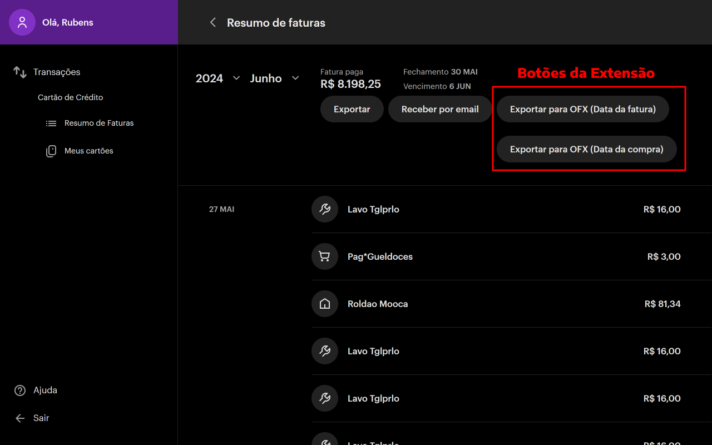

# NuBank OFX - Meu Dinheiro Web
Adiciona um botão para exportação do extrato do cartão de credito do Nubank para OFX otimizado para Meu Dinheiro Web e outras plataformas financeira que aceite arquivos .OFX, com opção de exportar com a data das transalações na fatura ou com as datas da compra da transalação que geralmente tem uma diferença de 1 dia.

## Instale a extensão no seu navegador:

